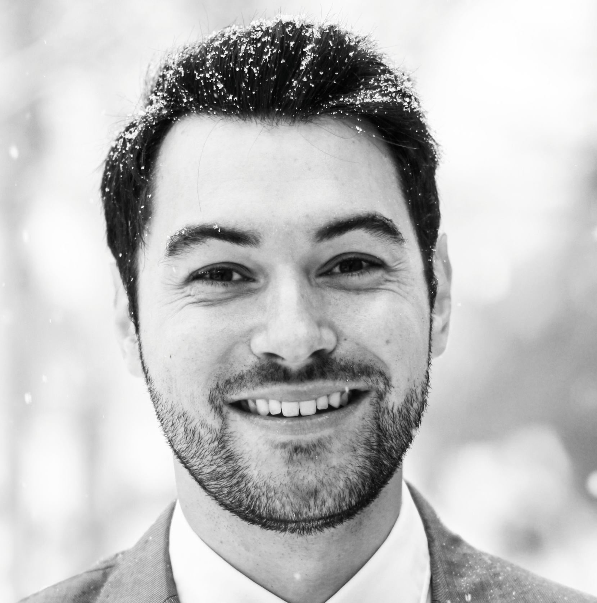

    

        <!-- Hover Image (another picture shown on hover) -->
        
        <!-- Original Profile Picture -->
        
    

    

        <h2><b>Kilian Fatras</b></h2>
        <h3><b>Machine Learning Research Scientist at EvolutionaryScale</b></h3>
    

 
## **About Me**
I am a **machine learning research scientist** at [EvolutionaryScale](https://www.evolutionaryscale.ai/). For the past couple of years, I have worked on **protein design** and **generative modeling**. My expertise lies at the intersection of **computational biology** and **generative AI**, where I leverage advanced **generative models** (protein language models and diffusion-like models) to **design functional proteins** for real-world applications in **drug discovery and structural biology**. My resume can be found [here](pdf/cv_kilian_fatras.pdf) (updated on 2025-04).

Previously, I was a **Postdoctoral Fellow** at **Mila** and **McGill University** in the beautiful city of Montréal. I worked under the mentorship of **Prof. Adam Oberman** and **Prof. Ioannis Mitliagkas**. During this time, I focused on **generative models**, **distribution shifts** and **optimal transport**. In terms of applications, I started to work on computational biology by applying these algorithms on single-cell trajectory. I also spent some time on open-source software by co-creating the **TorchCFM** library, which open-sources our work on **Flow Matching generative models**.

I completed my **PhD** under the supervision of **Prof. Nicolas Courty** and **Prof. Rémi Flamary**. I had the chance to be at **INRIA Rennes** in Brittany (my native French region). I worked on the intersection of **optimal transport** and **deep learning**, with applications in **domain adaptation**, **noisy labels**, and **generative modeling**. I especially developed a strong expertise on optimal transport and its minibatch approximation. The full recording of my thesis defense can be found [here](https://www.youtube.com/watch?v=paqpidEnnHw) and the manuscript is available [here](pdf/thesis_kf.pdf).

Beyond my research, I enjoy exploring New York City with my wife. We also spend some time outside the city, whether it's **hiking** or **scuba diving** when we are in the Caribbean.

## **Research Interests**
For a comprehensive list of my published works, visit my [Google Scholar](https://scholar.google.ca/citations?hl=fr&user=DHMjyDgAAAAJ&view_op=list_works). My current research areas include:

- **New Generative Models**  
   - Designing innovative **diffusion models** and **flow matching** methods for protein-related tasks, images, and tabular data.  
   - Exploring cutting-edge approaches in **masked language models**, such as **discrete diffusion** and **discrete flow matching**, to push the boundaries of generative modeling and protein design.

- **Protein Structure and Sequence Generation**  
   - Advancing **deep generative models**  for **3D protein backbone generation** and **sequence design**.  
   - Exploring **molecular evolution** using AI-driven techniques to predict novel, functional proteins.
   - Innovating in **protein-protein interactions** by using **spatial constraints**, **evolutionary information**, and **machine learning-based docking strategies** to design optimized multimeric structures and binders.