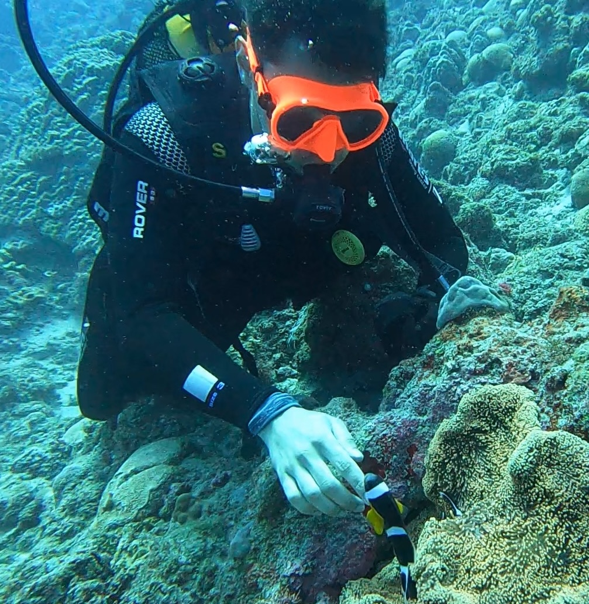
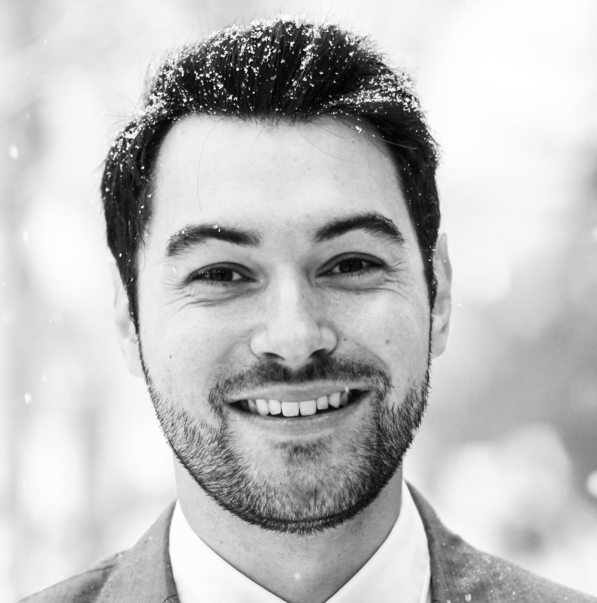

    

        <!-- Hover Image (another picture shown on hover) -->
        
        <!-- Original Profile Picture -->
        
    

    

        <h2><b>Machine Learning Research Scientist</b></h2>
        <h3>Training Foundation Models to Decode the Complexity of Life</h3>
    

 

## **About Me**

I am a **machine learning research scientist** at [EvolutionaryScale](https://www.evolutionaryscale.ai/). I work at the intersection of machine learning and computational biology. In a nutshell, I train **foundation models** (from diffusion models to protein language models) to **understand and design proteins** for real-world applications in **drug discovery** and **biology**.

Previously, I was a **Postdoctoral Fellow** at **Mila** and **McGill University** in Montréal, where I worked with **Prof. Adam Oberman** and **Prof. Ioannis Mitliagkas**. My research during this time focused on **generative modeling**, **distribution shifts**, and **optimal transport**. I applied some of these methods to biological applications like **single-cell trajectory inference** and **protein design**. I also co-created the open-source [TorchCFM](https://github.com/atong01/conditional-flow-matching) package to share our work on **Flow Matching models**.

I completed my **PhD** at **INRIA Rennes** in Brittany, France, under the supervision of **Prof. Nicolas Courty** and **Prof. Rémi Flamary**. My work explored the intersection of **optimal transport** and **deep learning**, with applications to **domain adaptation**, **learning with noisy labels**, and **generative modeling**. Another core element of my PhD was the study of **minibatch optimal transport**. My [thesis defense](https://www.youtube.com/watch?v=paqpidEnnHw) and [manuscript](pdf/thesis_kf.pdf) are available online.

My résumé can be found [here](pdf/cv_kilian_fatras.pdf) *(last updated: April 2025)*. Outside of research, I enjoy exploring New York City with my wife and love getting outdoors—whether it's **hiking** in the Hudson Valley or **scuba diving** in the Caribbean.

---

## **Research Interests**

For a complete list of my publications, visit my [Google Scholar](https://scholar.google.ca/citations?hl=fr&user=DHMjyDgAAAAJ&view_op=list_works). My current areas of focus include:

- Designing novel **diffusion models** and **flow matching techniques** for protein modeling, computer vision, and tabular data.  
- Developing **multi-modal protein models** for folding, inverse folding, unconditional and conditional protein generation.
- Designing **binders** against therapeutically relevant targets via **sequence and structure-based conditional methods**.
- Extracting meaningful protein information from **protein language models**.
- Designing **scalable and computationally efficient architectures** for protein modeling.

---

**Feel free to reach out** if you’re interested in discussing any of these research areas!
